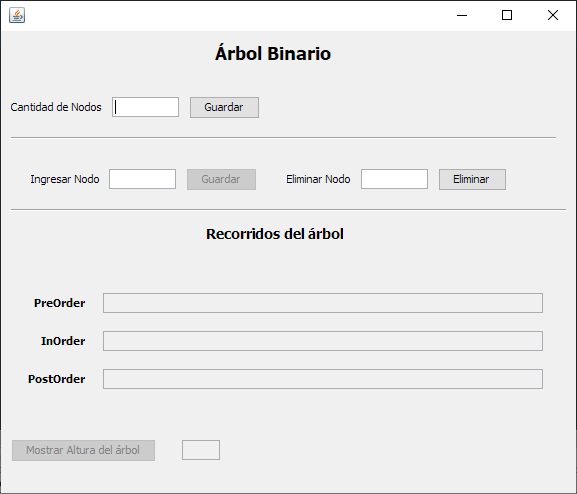
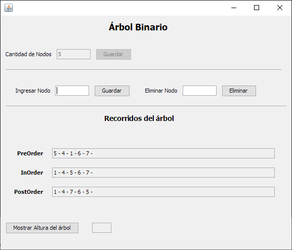

#  Árbol binario

## Funciones

* Indicar cantidad de nodos
* Insertar Nodos
* Imprimir lista de nodos en preOrden
* Imprimir lista de nodos en inOrden
* imprimir lista de nodos en postOrden
* imprimir la altura del árbol

## Detalles

* Lenguaje Java
* JDK 8
* Netbeans 8.2
* Windows 10

## Capturas

### Menú

